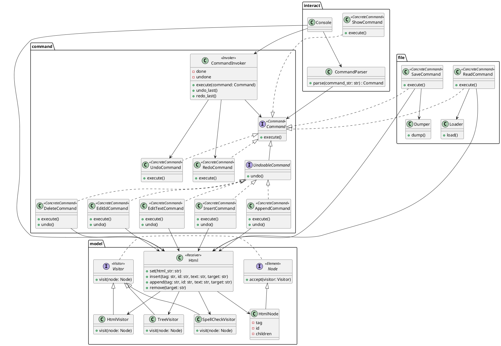
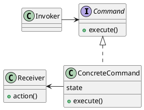
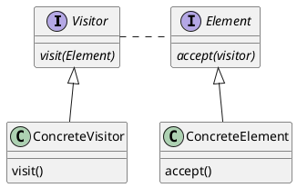

# Simple Html Editor

The html editor maintains a html script beneath and accepts a set of commands from terminal to access and manipulate it.

Running:
```sh
python3 src/interact/console.py
```
Testing on all test cases:
```sh
python3 -m unittest discover -s ./test -p "*_test.py"
```


Supported commands are decribed as follows:

## User Interface

- Editing

1. Insert before specified element
```sh
insert tagName idValue insertLocation [textContent]
```

2. Append inside specified element
```sh
append tagName idValue parentElement [textContent]
```

3. Edit id of specified element
```sh
edit-id oldId newId
```

4. Edit text of specified element
```sh
edit-text element [newTextContent]
```

5. Delete specified element
```sh
delete element
```

- Displaying

6. Print html as script text
```sh
print-indent [indent]
```

7. Print html as tree
```sh
print-tree
```

8. Perform spell checking on texts in html
```sh
spell-check
```

- IO

9. Read from file
```sh
read filepath
```

10. Save to file
```sh
save filepath
```

11. Initiate with default
```sh
init
```

- Undo/Redo

12. Undo
```sh
undo
```

13. Redo
```sh
redo
```


The succeeding part discusses design concerns.

## Architecture

`Console` serves as entry of the editor. The relationships between major classes are as below:



Among which two design patterns are adapted.

- Command Pattern

The Command pattern is used as the overall structure, aiming to stay open to changes on commands.

A typical Command pattern is composed of these parts:



In which an invoker invokes commands (returned from frontend) via `command.execute()`, and the commands do their logic via calling methods of the receiver, e.g., `receiver.action()`. This approach decouples assigning commands with the actual logic of each command by polymorphism, making it easy to add new commands without changing the existing commands and the invoker.

In the case of this html editor, an invoker `CommandInvoker` takes commands returned by a parser `CommandParser`, which parses commands input from terminal. Most commands do their job through methods of the receiver, `Html`, while the special commands `undo` and `redo` is straightly implemented in the invoker, by maintaining two stacks of done and undone commands.

Now in case I want to add a new insert command (like inserting after specified element). All I need to do is adding a new class `InsertAfterCommand` which extends Command in the `command` package, adding a parsing entry in the `CommandParser`, and implement this command inside `Html`. This change is transparent to the rest of the codes, including `CommandInvoker`.

- Visitor Pattern

The Visitor pattern is used inside the `model` package, aiming to make the codes reuseable and readable.



A typical Visitor pattern solves the problem of performing different operations on every node of a graph. The graph may consists of nodes of different types, and each operation need to be handled differently on different types of nodes. In Visitor pattern, a node will tell the visitor its type when accepting a visitor, which has a set of methods to handle each type, as the node certainly knows its own type. Also the visitor may stay unaware of the graph sturcture, as in `node.accept()` we can do something like
```
accept(visitor):
  visiter.visit(this)
  for successor in neighbors:
    successor.accept()
```

In this html editor the nodes are acturally of the same type `HtmlNode`, and in some visitors it is necessary to make successor elements accept itself inside its `visit()`, because some post operations is needed. However adapting Visitor pattern do keep the code clean, and make it easy to implement new visitors as well as reuse existing visitor such as the `TreeVisitor` on other kind of nodes.
